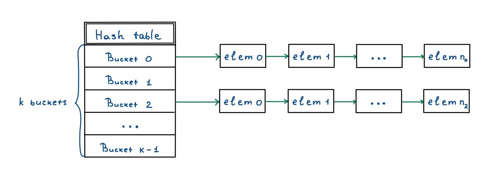

# Hash table

## Contents
1. [Goals](#goals)
2. [Brief theory](#brief-theory)
    - [What is a hash table?](#what-is-a-hash-table)
    - [What hash table do we use?](#what-hash-table-do-we-use)
3. [Implementation details](#implementation-details)

### Goals
1. **Implement** a hash table that can recieve different hash functions.
2. **Compare** hash functions and choose the most efficient.
3. **Explore** several code fragments within different compiler optimisation flags.
4. **Analyze** code via [pref](https://perf.wiki.kernel.org/index.php/Main_Page) utility and find code bottlenecks.
5. **Optimize** bottlenecks by other decisions in code architecture.
6. **Optimize** code bottlenecks with intrinsic functions and inline assembly.

### Brief theory
#### What is a hash table?
[Hash table](https://en.wikipedia.org/wiki/Hash_table) is a data structure that implements an associative array, also called a dictionary, which is an abstract data type that maps *keys* to *values*. 
A hash table uses a hash function to compute an *index* into an array of *buckets*, from which the desired value can be found. When there are several values in one bucket, it is called *collision*.

#### What hash table do we use?
For hash tables, the main goal is to choose a proper *hash function* and find the most efficient and quick ways to solve *collisions*. During this project we are using a [separate chaining](https://en.wikipedia.org/wiki/Hash_table#Separate_chaining) method based on a doubly-linked list.

As for the hash functions' choice, there will be tests for some of them to choose more suitable one.

### Implementation details
Detailed code description can be found in [documentation](). This paragraph is about some choices, their pros and cons. 
1. Doubly-linked list is used instead of a single-linked to gain delete functions complexity $\mathcal{O}(1)$. It uses more memory, but gives much better performance.
2. Lists are originally based on a separated in memory sequence of nodes. This method uses more allocations and less cache-friendly, but is more structured to easy to implement. In [paragraph 5]() we will compare it with the implementation via array.
3. I wanted to make a universal hash table implementation for abstract data types, so it uses `void*` types and recieves data sizes. Although this method is universal, it uses more allocations and more complex comparisons than with a fixed data type. We will compare these two implementations in [paragraph 5]().
4. Hash table **does not** perform a rehash when loading factor is too high. It uses a constant number of buckets.
5. Calloc() and malloc() functions are both used. malloc() function is used when data is being initialized immediately after, and calloc() is used when memory might stay uninitialized for some time (like array allocation).